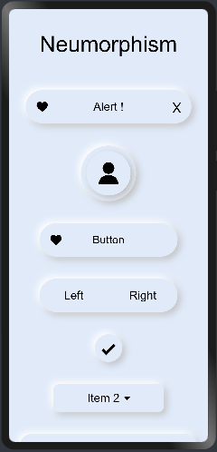
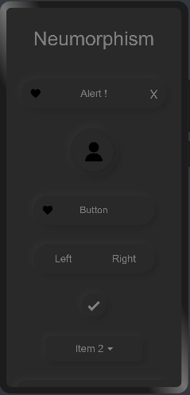

# Neumorphism_Theme

# Installation :

Install using npm inside pages directory

```npm init -y```

```npm i hmos-neumorphism ```

# Note :

Add this css snippet when passing input or button through slot .

```css
button, input{
    width: 100%;
    height: 100%;
    background-color:transparent;
    text-color: black;
}
```

# Theme

<p float="left">



</p>

Import:
```html
<element name='neutheme' src='../node_modules/hmos-neumorphism/theme/theme.hml'></element>
```

Usage:
```html

<!--You can choose between following themes:-->

<!--white-->
<!--silver-->
<!--gray-->
<!--black-->
<!--red-->
<!--maroon-->
<!--yellow-->
<!--olive-->
<!--lime-->
<!--green-->
<!--aqua-->
<!--teal-->
<!--blue-->
<!--navy-->
<!--pink-->
<!--purple-->

<neumorphism theme="silver" color="black">
</neumorphism>
```

# Reference:

<a href="https://neumorphism.io/">neumorphism.io</a>

<a href="https://ismail9k.github.io/neomorphism/">ismail9k.github.io/neomorphism</a>
