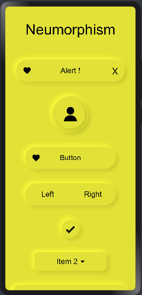

# Neumorphism_Theme

# Installation :

1. Copy the neumorph_theme folder in your repo.
2. Add neumorphism as a dependency in your package.json file.

```json
{
  "dependencies": {
    "neumorphism": "file:../neumorph_theme"
  }
}
```

# Note :

Add this css snippet when passing input or button through slot .

```css
button, input{
    width: 100%;
    height: 100%;
    background-color:transparent;
    text-color: black;
}
```

# Theme

<p float="left">



</p>

Import:
```html
<element name='neumorphism' src='../../../../../../node_modules/neumorphism/theme/theme.hml'></element>
```

Usage:
```html

<!--You can choose between following themes:-->

<!--white-->
<!--silver-->
<!--gray-->
<!--black-->
<!--red-->
<!--maroon-->
<!--yellow-->
<!--olive-->
<!--lime-->
<!--green-->
<!--aqua-->
<!--teal-->
<!--blue-->
<!--navy-->
<!--pink-->
<!--purple-->

<neumorphism theme="silver" color="black">
</neumorphism>
```
